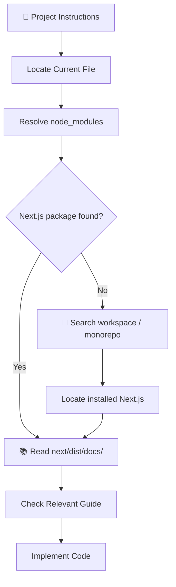
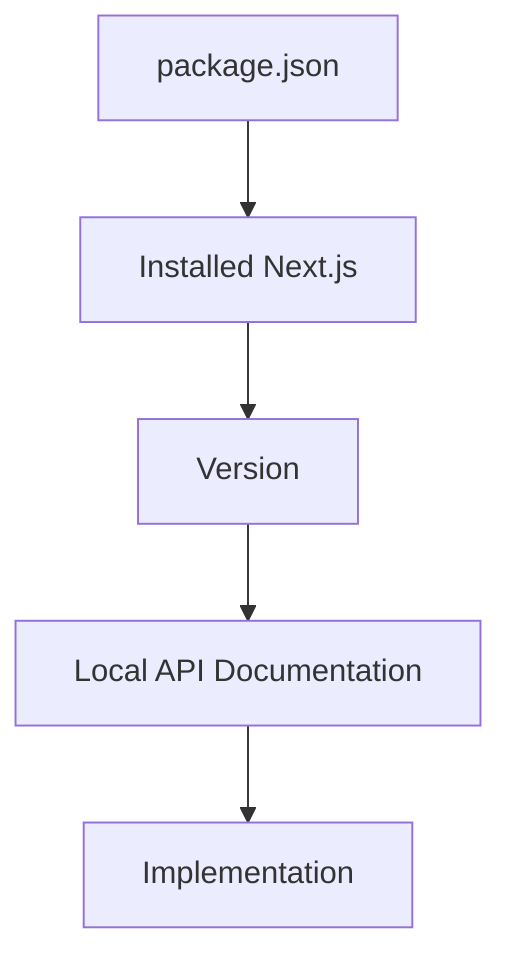
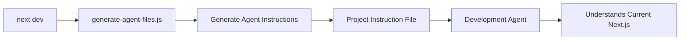
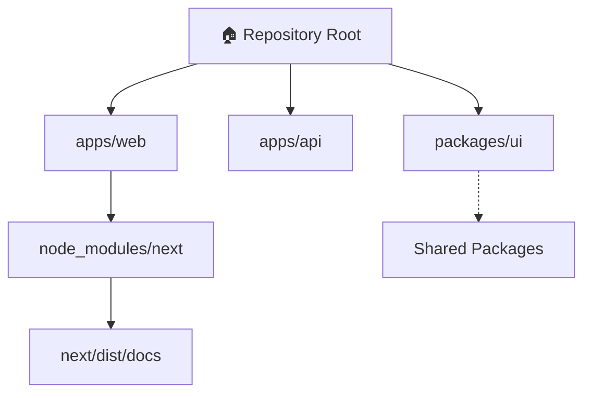

# This is NOT the Next.js you know

> ⚠️ **Important: This project may use a version of Next.js whose APIs, conventions, and file structure differ significantly from your prior knowledge or training data.**

This version has **breaking changes** — APIs, conventions, and file structure may all differ from your training data.

Before writing or modifying any Next.js code, **read the relevant local documentation** shipped with the installed version of Next.js.

---

## 1. Mandatory Local Documentation Check

The authoritative documentation for this project is located at:

```text
node_modules/next/dist/docs/
```

The documentation path must be resolved **from the location of this file**.

In a monorepo, the `next` package may not be visible from the repository root. Therefore, do not assume that:

```text
./node_modules/next/
```

is the correct location.

### Documentation Resolution



---

# 2. Do Not Trust Training Data

Next.js APIs can change between versions.

Therefore:

```text
❌ Old knowledge
      ↓
❌ Assumed API
      ↓
❌ Write code immediately
```

Instead:

```text
✅ Installed Next.js version
      ↓
✅ Local documentation
      ↓
✅ Deprecation notices
      ↓
✅ Current API
      ↓
✅ Write code
```

### Golden Rule

> **The installed Next.js version and its local documentation are the source of truth — not prior knowledge, tutorials, or remembered APIs.**

---

# 3. Required Development Workflow

Before implementing any Next.js feature, follow this sequence:

```mermaid
flowchart LR
    A["1️⃣ Inspect Project"] --> B["2️⃣ Identify Next.js Version"]

    B --> C["3️⃣ Locate Local Docs"]

    C --> D["4️⃣ Read Relevant Guide"]

    D --> E["5️⃣ Check Deprecations"]

    E --> F["6️⃣ Implement"]

    F --> G["7️⃣ Run Type Check"]

    G --> H["8️⃣ Run Tests / Build"]

    H --> I["✅ Verify"]
```



---

# 4. Version Verification

Before using an unfamiliar Next.js API, verify which version is actually installed.

Conceptually:

```text
Project
  │
  ├── package.json
  │
  └── node_modules/
        │
        └── next/
             │
             ├── package.json
             └── dist/
                  └── docs/
```

The installed package version should be treated as authoritative.



---

# 5. Deprecation Awareness

The local documentation may contain **deprecation notices** or migration guidance.

These must be checked before implementing APIs that may have changed.

```text
┌────────────────────────────────────────────┐
│           NEXT.JS API DECISION             │
├────────────────────────────────────────────┤
│                                            │
│  Is this API documented locally?           │
│                  │                         │
│          ┌───────┴───────┐                 │
│          │               │                 │
│         YES              NO                │
│          │               │                 │
│          ▼               ▼                 │
│     Check API       Investigate first     │
│          │                                 │
│          ▼                                 │
│   Deprecation notice?                     │
│          │                                 │
│     ┌────┴────┐                            │
│    YES       NO                            │
│     │         │                            │
│     ▼         ▼                            │
│  Migrate    Implement                     │
│                                            │
└────────────────────────────────────────────┘
```

---

# 6. Generated Agent File Warning

This block is automatically generated and maintained by `next dev`.

The source responsible for generating this block should be verified at:

```text
node_modules/next/dist/server/lib/generate-agent-files.js
```

### Important

Do **not** treat this block as ordinary documentation that can simply be deleted.

Its lifecycle is:



---

# 7. Why Removing the Block Does Not Work

If this generated section is removed manually:

```text
Project File
     │
     ▼
Remove generated block
     │
     ▼
next dev
     │
     ▼
generate-agent-files.js
     │
     ▼
Block recreated
```

Therefore:

> **Removing the block from a Git diff does not permanently remove it.**

Instead, understand why it exists and preserve it when appropriate.

---

# 8. Repository State

The generated file may appear as an uncommitted change.

There are two possible states:

```text
                 ┌──────────────────┐
                 │ Generated Change │
                 └────────┬─────────┘
                          │
                 ┌────────┴────────┐
                 │                 │
              Commit            Remove
                 │                 │
                 ▼                 ▼
        Tree remains clean    next dev
                               recreates it
```

The project instructions explicitly state:

> **Committing the generated block with your work keeps the Git tree clean.**

---

# 9. Agent Implementation Rules

When an AI coding agent works on this repository, it must follow these rules:

### Before Coding

```text
1. Identify installed Next.js version
2. Locate next package
3. Locate next/dist/docs/
4. Read the relevant documentation
5. Check deprecation notices
6. Inspect existing project conventions
```

### During Coding

```text
Use:
    ↓
Current installed API
    ↓
Current project conventions
    ↓
Local documentation
```

Avoid:

```text
Old tutorial
     ↓
Stack Overflow answer
     ↓
Memory of older Next.js
     ↓
Unverified implementation
```

---

# 10. Monorepo Consideration

For monorepos, the Next.js package may be installed at a workspace-specific location.



Therefore:

> **Never assume the repository root is the package root.**

Always resolve the installed package from the appropriate project context.

---

# 11. Implementation Safety Gate

Before introducing a Next.js API, the developer or coding agent should pass this checklist:

```text
┌──────────────────────────────────────────────┐
│        NEXT.JS IMPLEMENTATION GATE           │
├──────────────────────────────────────────────┤
│                                              │
│ ✓ Installed version identified               │
│ ✓ Correct next package located               │
│ ✓ Relevant local documentation read          │
│ ✓ Breaking changes checked                   │
│ ✓ Deprecation notices checked                │
│ ✓ Existing project conventions inspected     │
│ ✓ API implementation verified                │
│ ✓ TypeScript check passes                    │
│ ✓ Build/tests pass                           │
│                                              │
│              ✅ READY TO COMMIT              │
└──────────────────────────────────────────────┘
```

---

# 12. Core Principle

```text
                 ┌───────────────────────┐
                 │  INSTALLED NEXT.JS    │
                 │       VERSION         │
                 └───────────┬───────────┘
                             │
                             ▼
                 ┌───────────────────────┐
                 │   LOCAL DOCUMENTATION │
                 └───────────┬───────────┘
                             │
                             ▼
                 ┌───────────────────────┐
                 │ DEPRECATIONS /        │
                 │ BREAKING CHANGES      │
                 └───────────┬───────────┘
                             │
                             ▼
                 ┌───────────────────────┐
                 │       IMPLEMENT       │
                 └───────────┬───────────┘
                             │
                             ▼
                 ┌───────────────────────┐
                 │   TEST + TYPECHECK    │
                 └───────────┬───────────┘
                             │
                             ▼
                 ┌───────────────────────┐
                 │     TRUSTED CODE      │
                 └───────────────────────┘
```

> **Never implement a Next.js API based solely on memory. Verify the installed version, read its local documentation, respect its deprecations, and then write the code.**

---

## Quick Reference

| Requirement     | Rule                                           |
| --------------- | ---------------------------------------------- |
| Next.js API     | Verify against installed version               |
| Documentation   | Use `node_modules/next/dist/docs/`             |
| Monorepo        | Resolve package from the correct workspace     |
| Deprecations    | Check before implementation                    |
| Generated block | Do not manually remove                         |
| Generator       | `next/dist/server/lib/generate-agent-files.js` |
| `next dev`      | May recreate generated instructions            |
| Code quality    | Type-check and validate after implementation   |
| Source of truth | Installed package + local documentation        |