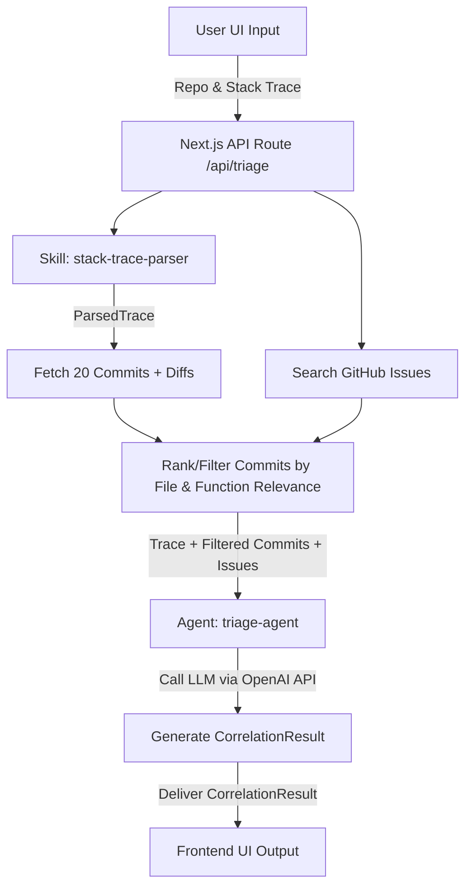

# Root Cause Architecture Document

This document describes the architectural layout, data structures, and operational lifecycle of the "Root Cause" production debugging assistant.

## Tech Stack
- **Frontend / Backend**: Next.js 15 (React 19, TypeScript, App Router).
- **Backend API Routes**: Used as a secure middleware boundary. Direct calls to GitHub REST API and OpenAI-compatible LLM endpoint happen server-side only.
- **Styling**: Vanilla CSS and CSS Modules.
- **GitHub Integration**: Personal access token read from `GITHUB_TOKEN` environment variable.
- **LLM Integration**: OpenAI-compatible LLM endpoint via `LLM_API_KEY` and `LLM_BASE_URL`.

---

## Data Models

```typescript
export interface Commit {
  hash: string;
  author: string;
  message: string;
  date: string;
  changedFiles: string[];
  diffText: string;
}

export interface Issue {
  number: number;
  title: string;
  body: string;
  state: "open" | "closed";
  url: string;
}

export interface ParsedTrace {
  file: string;
  function: string;
  line: number;
}

export interface CorrelationResult {
  rootCause: string;
  citedCommitHash: string | null;
  citedIssueNumber: number | null;
  suggestedLocation: string;
}
```

---

## System Flow



1. **Input**: User inserts repository (`owner/repo`) and raw error trace in the UI.
2. **Parse**: The `stack-trace-parser` module extracts `{ file, function, line }` entries.
3. **Fetch Commits & Issues**: 
   - Requests latest 20 commits including files diff content from GitHub.
   - Searches GitHub open/closed issues using keywords extracted from the stack trace header/message.
4. **Rank/Relevance Filter**: Matches files and paths in the parsed stack trace elements against the list of `changedFiles` in the 20 commits. Commits containing matches are boosted in relevance.
5. **LLM Correlation via Triage Agent**: Combines parsed trace details, relevant commits (top relevance sorted), and matching issues. Instructs LLM to analyze and respond with the specific root cause, citing supporting commit hashes or issue numbers, and suggesting a fix file.
6. **Output**: Renders the analysis with clickable links to GitHub.
